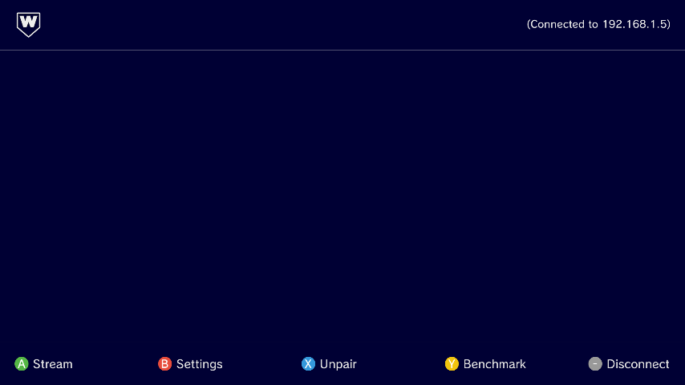
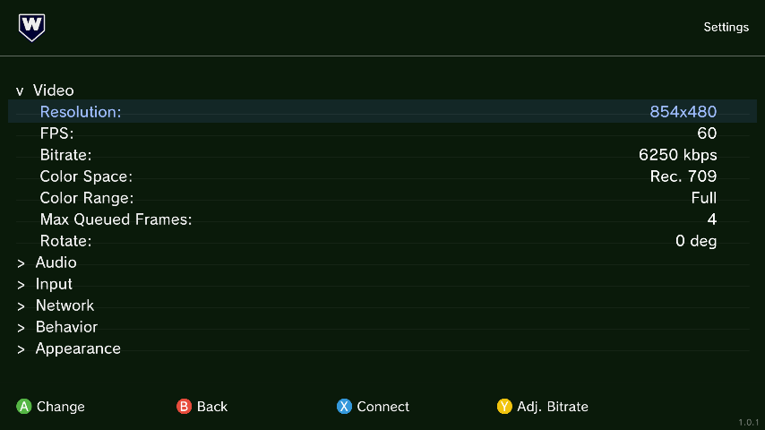
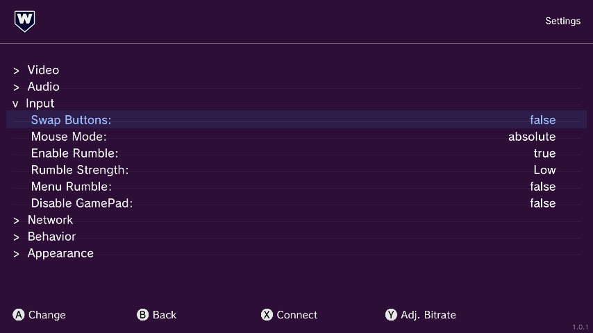
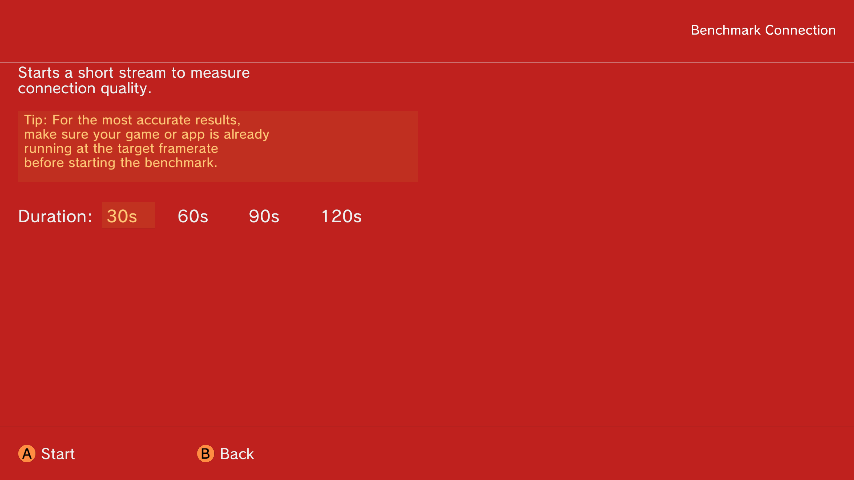
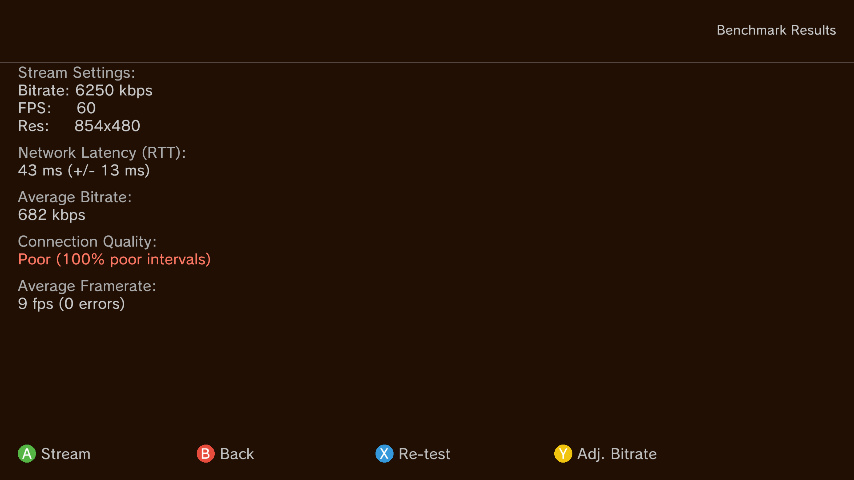
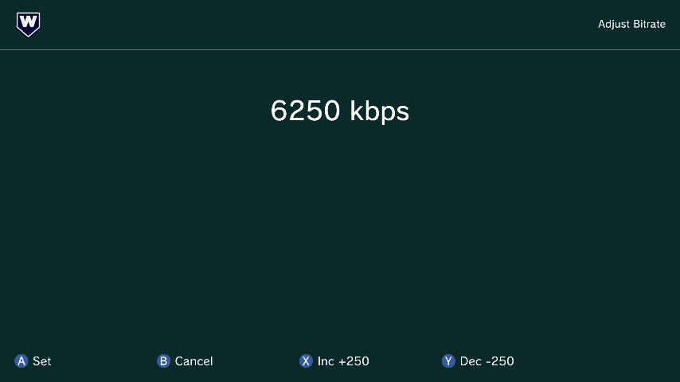
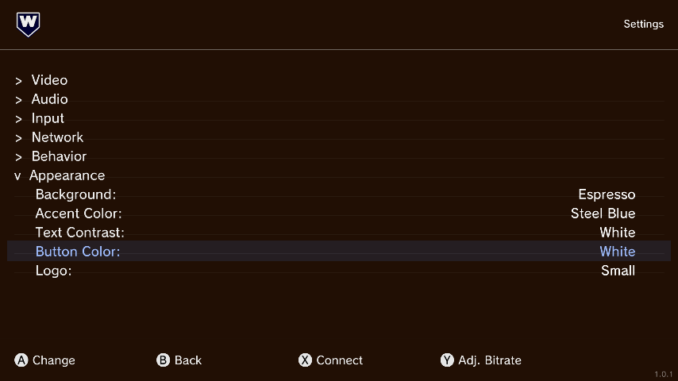
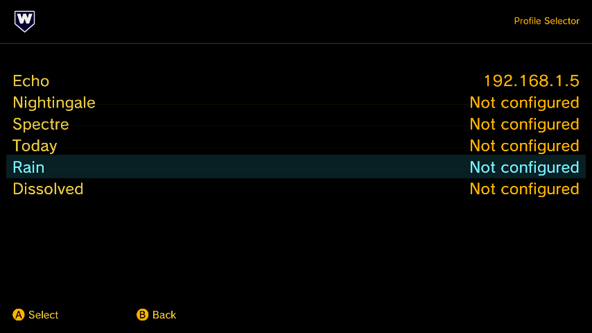

<div align="center">


[](LICENSE)
[](#)
[](#)

A fork of [Moonlight Wii U](https://github.com/GaryOderNichts/Moonlight-WiiU) by GaryOderNichts, itself a port of [Moonlight Embedded](https://github.com/moonlight-stream/moonlight-embedded) — an open-source client for [Sunshine](https://github.com/LizardByte/Sunshine) and NVIDIA GameStream.

</div>

---

## Overview

Moonlight lets you stream your full collection of games and applications from your PC to other devices to play them remotely. wibelight extends this experience to the Wii U fully configurable through UI, custom themes, GamePad rumble support and color space & range controls.

> **Note:** wibelight is **not configuration-file backwards compatible** with [Moonlight Wii U](https://github.com/GaryOderNichts/Moonlight-WiiU). However, the `/keys/` folder could be reused, so connection with an already-configured host should continue to work without re-pairing.

## Screenshots

<div align="center">

| Connected | Video Settings | Input Settings |
|:---:|:---:|:---:|
|  |  |  |

| Benchmark | Benchmark Results | Adjust Bitrate |
|:---:|:---:|:---:|
|  |  |  |

| Theme Settings | Profile Selector
|:---:|:---:|
|  |  |

</div>

## ✨ Features

### Streaming
- H.264 video streaming from [Sunshine](https://github.com/LizardByte/Sunshine), [Apollo](https://github.com/ClassicOldSong/Apollo) or GeForce Experience

### Video
- Customizable resolution, framerate, bitrate, and packet size
- Color space (Rec. 709 / Rec. 601) and color range (Full / Limited) selection
- Adjustable max queued frames and screen rotation

### Audio
- Speaker configuration and adjustable buffer size
- Local audio passthrough option

### Input
- 🎮 Wii U GamePad rumble support with adjustable effect strength
- Mouse mode, button swapping, and GamePad toggle

### Extras
- Basic connection benchmark utility

### Profiles
- Up to 6 independent profiles, each with its own server, settings, and theme

### Network
- Configurable packet size and server IP
- Wake-on-LAN support with automatic MAC detection

### Appearance
- Fully themed UI — background, accent color, text contrast, and button color

## 📋 Requirements

| Requirement | Details |
|---|---|
| **PC** | Running [Sunshine](https://github.com/LizardByte/Sunshine), [Apollo](https://github.com/ClassicOldSong/Apollo) or ancient GeForce Experience with GameStream |
| **Console** | Wii U with homebrew support |
| **Network** | Both devices on the same local network |

## 🛠️ Building

Requires [devkitPPC](https://devkitpro.org/) with Wii U support.

```bash
git clone --recursive https://github.com/dougheater/wibelight.git
cd wibelight
make
```

The output is placed in `dist/wiiu/apps/wibelight/`. Copy the `wiiu` folder to the root of your SD card.

## ⚙️ Configuration

Settings are saved to `wibelight.json` in apps directory on first save.

| Category | Options |
|---|---|
| **Video** | Resolution, FPS, Bitrate, Color Space, Color Range, Max Queued Frames, Rotate |
| **Audio** | Speaker Configuration, Buffer Size, Local Audio |
| **Input** | Enable Rumble, Rumble Strength, Mouse Mode, Swap Buttons, Disable GamePad |
| **Network** | Packet Size, Server IP, Wake-on-LAN, MAC |
| **Behavior** | Auto-Stream, Auto-Connect, App Choice, View Only, Quit After |
| **Appearance** | Background, Accent Color, Text Contrast, Button Color, Logo Style |

## 📖 Usage

### Managing profiles
- Select a profile from the main menu
- Each profile stores its own server IP, video/audio/input settings, and theme preferences
- Switch profiles at any time from the main menu to quickly change hosts or configurations

### Wake-on-LAN
- Enable WoL under **Settings → Network → Wake-on-LAN**
- MAC address is auto-detected after pairing
- If the PC is off and connection fails, a WoL magic packet is sent automatically
- The app waits for the host to boot, then retries the connection

### Benchmark
- Run a benchmark from the connected screen to test stream quality
- Results show frame quality distribution and average RTT
- Adjust Bitrate to fine-tune based on your network conditions

### Controlling the stream
- **GamePad Home** (long press) — stop the stream

## Credits

- **[Moonlight Embedded](https://github.com/moonlight-stream/moonlight-embedded)** — Iwan Timmer (original project)
- **[Moonlight Wii U](https://github.com/GaryOderNichts/Moonlight-WiiU)** — GaryOderNichts (Wii U port)
- **[Sunshine](https://github.com/LizardByte/Sunshine)** — LizardByte (streaming server)
- **[Apollo](https://github.com/ClassicOldSong/Apollo)** — ClassicOldSong (streaming server)

## License

This project is licensed under [GPL v3](LICENSE).
